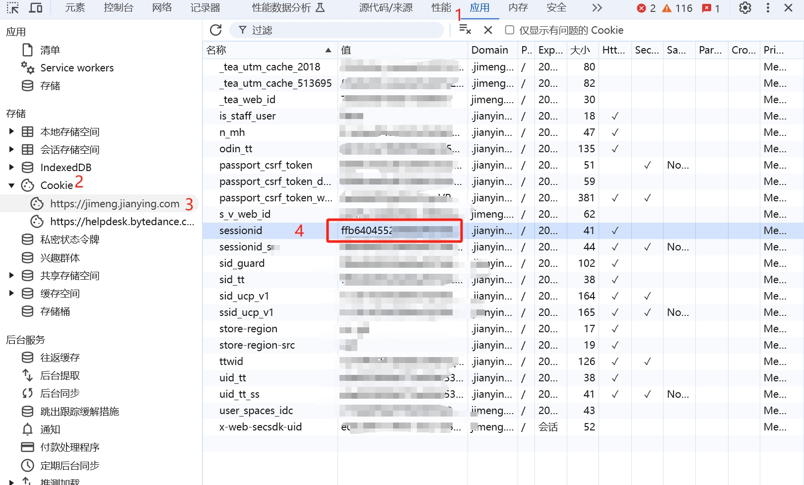

# Jimeng AI Free API

Jimeng AI Free API service - OpenAI compatible interface supporting Text-to-Image, Image-to-Image, and Video generation.


> 🎨 Opening up the powerful image and video generation capabilities of Jimeng AI to developers through an OpenAI-compatible interface.

## Project Introduction

### Overview

Jimeng AI Free API is a reverse-engineered API server that encapsulates the image and video generation capabilities of Jimeng AI into an OpenAI-compatible API interface. It supports the latest **jimeng-5.0-preview**, **jimeng-4.6** text-to-image models, **Seedance 2.0 multi-image intelligent video generation** (model name `jimeng-video-seedance-2.0`), and **Seedance 2.0-fast** (model name `jimeng-video-seedance-2.0-fast`), with zero-configuration deployment and multi-token support.

### Core Features

- 🖼️ **Text-to-Image**: Supports multiple models like jimeng-5.0-preview, jimeng-4.6, jimeng-4.5, etc., up to 4K resolution.
- 🎭 **Image-to-Image**: Multi-image composition, supporting 1-10 input images.
- 🎬 **Video Generation**: Models like jimeng-video-3.5-pro, supporting first-frame/last-frame control.
- 🌊 **Seedance 2.0 / 2.0-fast**: Multi-image intelligent video generation, supporting @1, @2 placeholders for image referencing, with the fast version generating even quicker.
- 🔗 **OpenAI Compatible**: Fully compatible with OpenAI API format, seamlessly connecting to existing clients.
- 🔄 **Multi-Account Support**: Supports polling through multiple sessionids.

### Tech Stack

| Technology | Version | Usage |
|------|------|------|
| Node.js | >=16.0.0 | Runtime Environment |
| TypeScript | ^5.0.0 | Development Language |
| Koa | ^2.15.0 | Web Framework |
| Playwright | ^1.49.0 | Browser Proxy (Seedance Anti-scraping Bypass) |
| Docker | latest | Containerized Deployment |

## Feature List

| Feature | Description | Models | Status |
|---------|---------|------|------|
| Text-to-Image | Generate images from text descriptions | jimeng-5.0-preview, jimeng-4.6, jimeng-4.5, jimeng-4.1, etc. | ✅ Available |
| Image-to-Image | Compose new images from multiple images | jimeng-5.0-preview, jimeng-4.6, jimeng-4.5, etc. | ✅ Available |
| Text-to-Video | Generate videos from text descriptions | jimeng-video-3.5-pro, etc. | ✅ Available |
| Image-to-Video | Generate videos using first/last frame images | jimeng-video-3.0, etc. | ✅ Available |
| Intelligent Multi-Image Video | Seedance 2.0 multi-image mixing | jimeng-video-seedance-2.0, seedance-2.0 | ✅ Available |
| Fast Multi-Image Video | Seedance 2.0-fast generation | jimeng-video-seedance-2.0-fast, seedance-2.0-fast | ✅ Available |
| Chat Interface | OpenAI compatible chat interface | All models | ✅ Available |

## Disclaimer

> ⚠️ **Important Note**
>
> **Reverse-engineered APIs are unstable. It is recommended to experience features on the official Jimeng AI website https://jimeng.jianying.com/ to avoid the risk of banning.**
>
> **This organization and individuals do not accept any financial donations or transactions; this project is purely for research, exchange, and learning purposes!**
>
> **For personal use only. Prohibit providing services externally or for commercial use to avoid causing service pressure on the official site, otherwise, you bear the risk yourself!**

## Installation Instructions

### Environment Requirements

- Node.js 16+
- npm or yarn
- Chromium browser (required for Seedance models, automatically managed via Playwright)
- Docker (optional)

### Method 1: Docker Deployment (Recommended)

**Using Docker Hub image:**

```bash
# Pull image
docker pull wwwzhouhui569/jimeng-free-api-all:latest

# Start container
docker run -it -d --init --name jimeng-free-api-all \
  -p 8000:8000 \
  -e TZ=Asia/Shanghai \
  wwwzhouhui569/jimeng-free-api-all:latest
```

**Build from source:**

```bash
# Clone project
git clone https://github.com/wwwzhouhui/jimeng-free-api-all.git

# Enter directory
cd jimeng-free-api-all

# Build image
docker build -t jimeng-free-api-all:latest .

# Start container
docker run -it -d --init --name jimeng-free-api-all \
  -p 8000:8000 \
  -e TZ=Asia/Shanghai \
  jimeng-free-api-all:latest
```

### Method 2: Source Installation

```bash
# Clone project
git clone https://github.com/wwwzhouhui/jimeng-free-api-all.git

# Enter directory
cd jimeng-free-api-all

# Install dependencies
npm install

# Install Chromium browser (required for Seedance models)
npx playwright-core install chromium --with-deps

# Development mode
npm run dev

# Production mode
npm run build && npm start
```

## Usage Instructions

### Getting SessionID

1. Visit [Jimeng AI](https://jimeng.jianying.com/) and log in to your account.
2. Press F12 to open developer tools.
3. Go to Application > Cookies.
4. Find the value for `sessionid`.



### Multi-Account Configuration

Supports multiple account sessionids, separated by commas:

```
Authorization: Bearer sessionid1,sessionid2,sessionid3
```

One will be randomly selected for each request.

### API Endpoints

| Endpoint | Method | Description |
|------|------|------|
| `/v1/chat/completions` | POST | OpenAI compatible chat interface |
| `/v1/images/generations` | POST | Text-to-Image interface |
| `/v1/images/compositions` | POST | Image-to-Image interface |
| `/v1/videos/generations` | POST | Video generation interface |
| `/v1/models` | GET | Get model list |

### Quick Start

**Text-to-Image Example:**

```bash
curl -X POST http://localhost:8000/v1/images/generations \
  -H "Content-Type: application/json" \
  -H "Authorization: Bearer your_sessionid" \
  -d '{
    "model": "jimeng-4.5",
    "prompt": "Beautiful sunset landscape, a cabin by the lake",
    "ratio": "16:9",
    "resolution": "2k"
  }'
```

**Video Generation Example:**

```bash
curl -X POST http://localhost:8000/v1/videos/generations \
  -H "Content-Type: application/json" \
  -H "Authorization: Bearer your_sessionid" \
  -d '{
    "model": "jimeng-video-3.5-pro",
    "prompt": "A cute kitten playing on the grass",
    "ratio": "16:9",
    "resolution": "720p",
    "duration": 5
  }'
```

**Seedance 2.0 Multi-Image Video Example:**

```bash
curl -X POST http://localhost:8000/v1/videos/generations \
  -H "Authorization: Bearer your_sessionid" \
  -F "model=jimeng-video-seedance-2.0" \
  -F "prompt=@1 and @2 two people start dancing" \
  -F "ratio=4:3" \
  -F "duration=4" \
  -F "files=@/path/to/image1.jpg" \
  -F "files=@/path/to/image2.jpg"
```

**Seedance 2.0-fast Quick Video Example:**

```bash
curl -X POST http://localhost:8000/v1/videos/generations \
  -H "Authorization: Bearer your_sessionid" \
  -F "model=jimeng-video-seedance-2.0-fast" \
  -F "prompt=The person in @1 starts to smile" \
  -F "ratio=4:3" \
  -F "duration=5" \
  -F "files=@/path/to/image1.jpg"
```

## Project Structure

```
jimeng-free-api-all/
├── src/
│   ├── index.ts                 # App entry
│   ├── daemon.ts                # Daemon management
│   ├── api/
│   │   ├── controllers/         # Business logic controllers
│   │   │   ├── core.ts          # Core tools (Token handling, etc.)
│   │   │   ├── images.ts        # Image generation logic
│   │   │   ├── videos.ts        # Video generation logic
│   │   │   └── chat.ts          # Chat completion logic
│   │   ├── routes/              # API route definitions
│   │   │   ├── index.ts         # Route aggregation
│   │   │   ├── images.ts        # /v1/images/* endpoints
│   │   │   ├── videos.ts        # /v1/videos/* endpoints
│   │   │   ├── chat.ts          # /v1/chat/* endpoints
│   │   │   └── models.ts        # /v1/models endpoint
│   │   └── consts/              # API constants and exceptions
│   └── lib/
│       ├── server.ts            # Koa server config
│       ├── browser-service.ts   # Browser proxy service (Seedance anti-scraping)
│       ├── config.ts            # Configuration management
│       ├── logger.ts            # Logger utility
│       ├── util.ts              # Helper tools
│       ├── request/             # Request handling classes
│       ├── response/            # Response handling classes
│       ├── exceptions/          # Exception classes
│       └── configs/             # Configuration schemas
├── configs/                     # Config directory
├── doc/                         # Document resources
├── Dockerfile                   # Docker build file
├── package.json                 # Project config
└── tsconfig.json                # TypeScript config
```

## Model Descriptions

### Text-to-Image Models

| User Model Name | Internal Model Name | Description |
|-----------|-----------|------|
| `jimeng-5.0-preview` | `high_aes_general_v50` | 5.0 Preview, latest model |
| `jimeng-4.6` | `high_aes_general_v42` | Latest model, recommended |
| `jimeng-4.5` | `high_aes_general_v40l` | High-quality model |
| `jimeng-4.1` | `high_aes_general_v41` | High-quality model |
| `jimeng-4.0` | `high_aes_general_v40` | Stable version |
| `jimeng-3.1` | `high_aes_general_v30l_art_fangzhou` | Art style |
| `jimeng-3.0` | `high_aes_general_v30l` | General model |
| `jimeng-2.1` | - | Older model |
| `jimeng-2.0-pro` | - | Older pro model |
| `jimeng-2.0` | - | Older model |
| `jimeng-1.4` | - | Early model |
| `jimeng-xl-pro` | - | XL Pro model |

### Video Models

| User Model Name | Internal Model Name | Description |
|-----------|-----------|------|
| `jimeng-video-3.5-pro` | `dreamina_ic_generate_video_model_vgfm_3.5_pro` | Latest video model |
| `jimeng-video-3.0` | - | Video generation 3.0 |
| `jimeng-video-3.0-pro` | - | Video generation 3.0 Pro |
| `jimeng-video-2.0` | - | Video generation 2.0 |
| `jimeng-video-2.0-pro` | - | Video generation 2.0 Pro |
| `jimeng-video-seedance-2.0` | `dreamina_seedance_40_pro` | Seedance 2.0 (Standard name, recommended) |
| `seedance-2.0` | `dreamina_seedance_40_pro` | Seedance 2.0 (Backward compatible alias) |
| `seedance-2.0-pro` | `dreamina_seedance_40_pro` | Seedance 2.0 (Backward compatible alias) |
| `jimeng-video-seedance-2.0-fast` | `dreamina_seedance_40` | Seedance 2.0-fast (Standard name) |
| `seedance-2.0-fast` | `dreamina_seedance_40` | Seedance 2.0-fast (Backward compatible alias) |

### Resolution Support

#### Image Resolution

| Resolution | 1:1 | 4:3 | 3:4 | 16:9 | 9:16 | 3:2 | 2:3 | 21:9 |
|--------|-----|-----|-----|------|------|-----|-----|------|
| 1k | 1024×1024 | 768×1024 | 1024×768 | 1024×576 | 576×1024 | 1024×682 | 682×1024 | 1195×512 |
| 2k | 2048×2048 | 2304×1728 | 1728×2304 | 2560×1440 | 1440×2560 | 2496×1664 | 1664×2496 | 3024×1296 |
| 4k | 4096×4096 | 4608×3456 | 3456×4608 | 5120×2880 | 2880×5120 | 4992×3328 | 3328×4992 | 6048×2592 |

#### Video Resolution

| Resolution | 1:1 | 4:3 | 3:4 | 16:9 | 9:16 |
|--------|-----|-----|-----|------|------|
| 480p | 480×480 | 640×480 | 480×640 | 854×480 | 480×854 |
| 720p | 720×720 | 960×720 | 720×960 | 1280×720 | 720×1280 |
| 1080p | 1080×1080 | 1440×1080 | 1080×1440 | 1920×1080 | 1080×1920 |

## Detailed API Documentation

### Text-to-Image Interface

**POST /v1/images/generations**

| Parameter | Type | Required | Default | Description |
|------|------|------|--------|------|
| model | string | No | jimeng-4.5 | Model name |
| prompt | string | Yes | - | Prompt, supports multi-image generation |
| negative_prompt | string | No | "" | Negative prompt |
| ratio | string | No | 1:1 | Aspect ratio |
| resolution | string | No | 2k | Resolution: 1k, 2k, 4k |
| sample_strength | number | No | 0.5 | Detail level 0-1 |
| response_format | string | No | url | url or b64_json |

### Image-to-Image Interface

**POST /v1/images/compositions**

| Parameter | Type | Required | Default | Description |
|------|------|------|--------|------|
| model | string | No | jimeng-4.5 | Model name |
| prompt | string | Yes | - | Prompt |
| images | array | Yes | - | Image URL array, 1-10 images |
| ratio | string | No | 1:1 | Aspect ratio |
| resolution | string | No | 2k | Resolution |

### Video Generation Interface

**POST /v1/videos/generations**

| Parameter | Type | Required | Default | Description |
|------|------|------|--------|------|
| model | string | No | jimeng-video-3.0 | Model name |
| prompt | string | Yes | - | Video description |
| ratio | string | No | 1:1 | Aspect ratio |
| resolution | string | No | 720p | Resolution: 480p, 720p, 1080p |
| duration | number | No | 5 | Duration: 4-15 sec (Seedance), 5 or 10 sec (Normal) |
| file_paths | array | No | [] | First/last frame image URLs |

### Seedance 2.0 / 2.0-fast Interface

**POST /v1/videos/generations**

| Parameter | Type | Required | Default | Description |
|------|------|------|--------|------|
| model | string | Yes | - | jimeng-video-seedance-2.0, jimeng-video-seedance-2.0-fast, or seedance-2.0 |
| prompt | string | No | - | Prompt, use @1, @2 to reference images |
| ratio | string | No | 4:3 | Aspect ratio |
| duration | number | No | 4 | Video duration 4-15 sec |
| files | file[] | Yes* | - | Uploaded images (multipart) |
| file_paths | array | Yes* | - | Image URL array (JSON) |

**Prompt Placeholders:**
- `@1` / `@image1` - References the first image
- `@2` / `@image2` - References the second image

## Development Guide

### Local Development

```bash
# Clone project
git clone https://github.com/wwwzhouhui/jimeng-free-api-all.git
cd jimeng-free-api-all

# Install dependencies
npm install

# Install Chromium browser (first time)
npx playwright-core install chromium --with-deps

# Development mode (hot reload)
npm run dev
```

### Build & Deploy

```bash
# Build production version
npm run build

# Start production service
npm start
```

## Update Log

### v0.8.4 (2026-02-18) - Fixed Seedance "shark not pass" anti-scraping
- 🐛 **Fixed Seedance video generation being intercepted by shark middleware**
- ✨ **Added BrowserService**: Uses headless Chromium via Playwright for automatic `a_bogus` signature injection.
- 🐳 **Docker Support Update**: Switched to `node:lts` with built-in Chromium dependencies.

## License

[MIT License](LICENSE)
